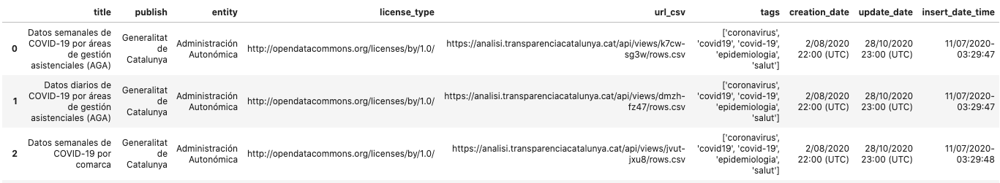
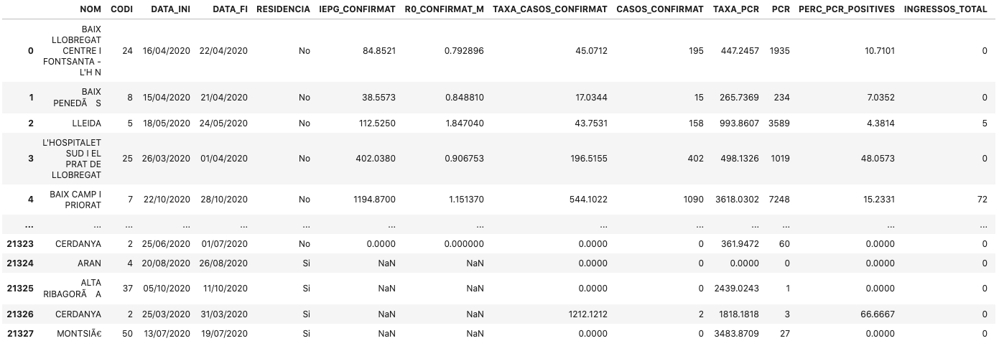

# M2-851 : Tipología y ciclo de vida de los datos -> P1 

[](https://doi.org/10.5281/zenodo.4256984)

## Introducción
    Muchas veces se tiene la problemática que para acceder a dataset de los sitios web que publican,
    se tiene que ir al sitio y descargarlo manualmente.
    Realizar un web scraping sobre la web -> datos.gob.es/es/catalogo 
    con parametros de búsqueda sobre la url para acceder a los diferentes dataset
    tipificados que contiene el catalogo de la web

## Objetivo
    Por la problemática presentada en la introducción, se pretende crear un dataset 
    que aglutine el conjunto de dataset accesibles por una búsqueda concreta.
    El objetivo que se pretende es tener un dataset actualizado de las ultimas publicaciones
    por los criterios de busqueda y de cada uno de las líneas de respuesta acceder al
    dataset en csv para su consulta o descarga.
    
## Descripción

Para acceder a la realización del web-scraping se usa la siguiente url:
```
"https://datos.gob.es/es/catalogo?theme_id=salud&publisher_display_name="+publisher+ \
           "&sort=metadata_created+desc&res_format_label="+type_file+ \
           "&q="+words_search+ \
           "&_publisher_display_name_limit=0"
```
Donde se usarán como parámetros de busqueda:
```
publisher = "Generalitat+de+Catalunya"
type_file = "CSV"
# Para mas palabras de busquedas incluir (+) en los espacios covid+19
words_search = "covid"
```
El resultado será un dataset en formato CSV


por el campo url_csv podremos acceder directamente al dataset con la información con la
que queremos trabajar leyendo directamente el archivo o descargar. 

ejemplo:



